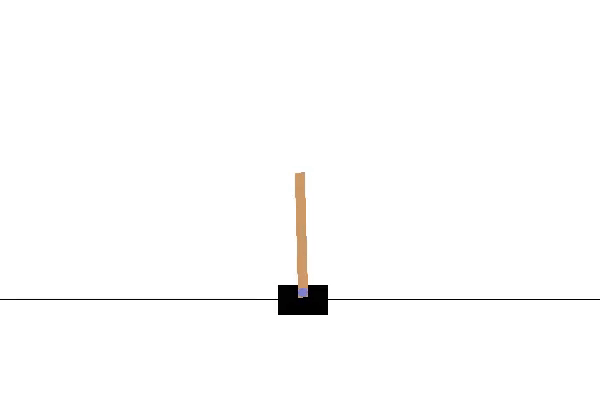

# cartpole-master
Playing with keras and gym.

A simple DQN learning to play cartpole.

# Usage
To train new model

```python train.py```

To show results with pretrained model

```python show.py```


